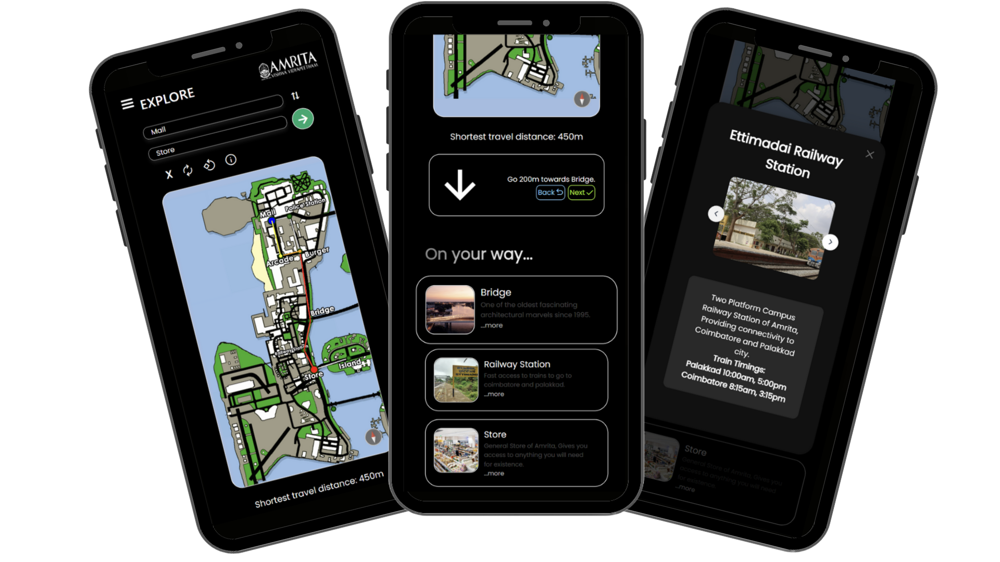
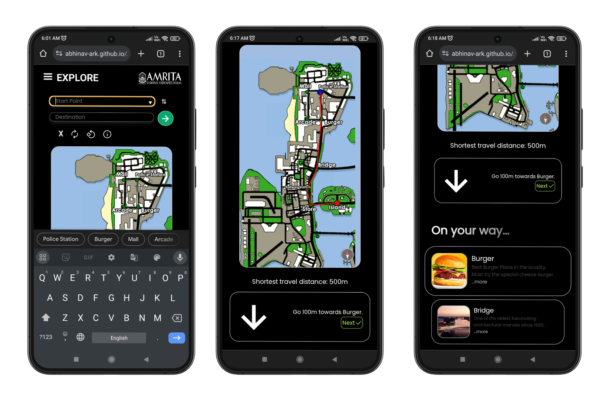
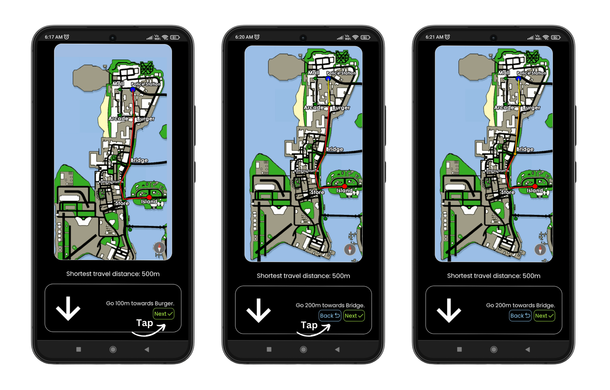
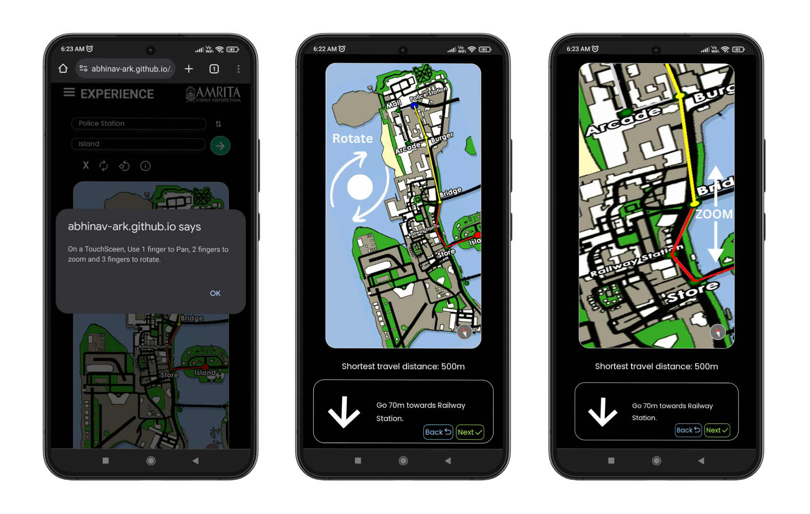
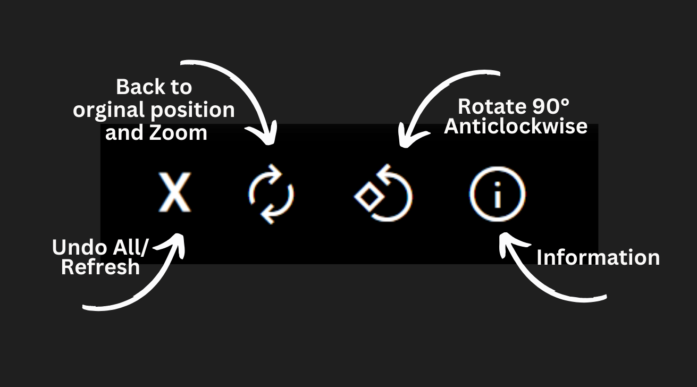

<h1 align="center"> Offline Navigator Web App </h1>

# Features
- [x] Zoomable, Pannable and Rotatable Map  Based on Fabric.js
- [x] On the way - Dynamic Places With Description and Model Detailed Description with Image Carousel
- [x] Colour Code Based Path Marking 
 -  `Yellow`: Completed
 -  `Orange`: Returned Back
 -  `Red`: Yet To Cover
- [x] Map Refresh, Rotate 90°, Back To 100% Zoom and 0° Rot Buttons
- [x] Dynamic Compass
- [x] Dynamic Directions Based on current Compass direction and Map Rotation
- [x] Destination Reached Alert Model
- [x] Custom Animated Hamburger Menu and Navbar (In Progress)

# Instructions 

- Select Start and destination points and tap on Go
- You now get a navigation instructor and Places On the Way List View

# Navigation

- The initial `Red` path on the map is the path to cover
- Tap on the Next button for directions to the next place on the way (You get an `Yellow` path on the map to indicate Covered path)
- Tap on the Back button if you accidentally pressed Next (You get an `Orange` path on the map to indicate Returned path)

# Interacting with the Map

- Zoom by using Two Fingers
- Rotate by using 3 fingers

## Map Toolbar

