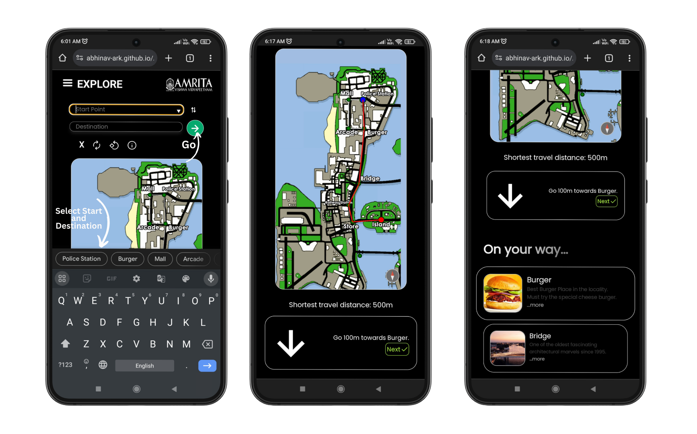

<!--  -->

  

<h1 align="center"> Offline Navigator Web App </h1>

# Features
- [x] Zoomable, Pannable and Rotatable Map  Based on Fabric.js
- [x] On the way - Dynamic Places With Description and Model Detailed Description with Image Carousel
- [x] Colour Code Based Path Marking 
 -  `Yellow`: Completed
 -  `Orange`: Returned Back
 -  `Red`: Yet To Cover
- [x] <b>Toolbar:</b> Map Refresh, Rotate 90°, Back To 100% Zoom and 0° Rot Buttons
- [x] Dynamic Compass
- [x] Dynamic Directions Based on current Compass direction and Map Rotation
- [x] Destination Reached Alert Model
- [x] Custom Animated Hamburger Menu and Navbar (In Progress)

# Instructions 

- Select Start and destination points and tap on Go
- You now get a navigation instructor and Places On the Way List View

# Navigation

- The initial `Red` path on the map is the path to cover
- Tap on the Next button for directions to the next place on the way (You get an `Yellow` path on the map to indicate Covered path)
- Tap on the Back button if you accidentally pressed Next (You get an `Orange` path on the map to indicate Returned path)

# Interacting with the Map

- `Zoom` by using Two Fingers
- `Rotate` by using 3 fingers
- The Red Needle of the Compass always points towards north of the map
- When you rotate the map, the direction arrow rotates automatically to adapt to the new changes.
> Rotate Functionality is only supported in touch screen displays as of now, and not yet supported in laptop trackpads.

## Map Toolbar

# On Your Way

- Below the navigation instructor, you get a list view of places on the way from your current location to your destination.
- Tap on any place to see the full description, images, timings, things to do and must-tries in that place.

# End Navigation and New NavBar

# Motivation Behind the Project
 When I moved to Amrita Vishwa Vidyapeetham University Campus in 2022 (After COVID Lockdown), I faced a lot of trouble not knowing routes to places, taking long routes and getting lost sometimes.
The existing Paper maps weren't very effective although they helped a little. Google maps didn't have all places and routes in the campus at that time. That is when I felt the need to make a navigator for the campus.

 One Year Later, I took up that idea for my Data Structures and Algorithms Course Project with my limited skillset at that point of time (`HTML`,`CSS` and `JS`)  and completed the current version of the prototype. I received permission from my university authorities to go ahead into expanding the project for the entire campus so i started working on designing our campus's map in `Autocad`.

 When I finished the design and was planning to start integrating the realworld measurements, location data and images into the graph, I was faced by a major challenge; Our expanding campus. Our University started rigorous construction activity in full fledge at a rapid pace, which continued to alter the entire landscape of our University Campus. That is when I realized the importance of modularity, and understood that, having a single image as the backbone of the terrain of Our University in my map was not a great Idea. Though I expected a few buildings to come up, and designed the map with the expected final aerial view of all the constructions in progress back then, I should have anticipated more buildings to come up.

 Unfortunately due to the inabilities in procuring the blueprint of the future campus, shortage of developers to maintain code, difficulties in attaching images and description of future buildings and uncertainity of finding volunteers to update the data regarding the Univerity Topography and Social Life in the future, I had to shelve this project in late 2023.

# Open Source
This project is opensource now, meaning anybody is free to use any of the ideas or pieces of code in this project, fork the repository and make changes to this project, or come up with a completely different new product based on this project.

> ❗Any Individuals interested to work towards finishing this project are welcome to contact me @ `abhinavramki2@gmail.com` or `cb.en.u4cse21001@cb.students.amrita.edu`

# Contributing
Refer to The [Code of Conduct](https://github.com/Abhinav-ark/Amrita_map/blob/with_navbar/CODE_OF_CONDUCT.md) before making a pull request to the repository, posting on the discussions section or involing in any public activity related to this repository.

# Improvement Ideas
- The algorithm currently being used is `A* Search`. Instead `Floyd Warshall Algorithm` can be run once through the graph, every time a new node is inserted and all pair shortest paths stored in a data structure, so we don't need to compute the shortest path everytime on the client side.
- `PWA`, Offline support with `Service workers` or offline `flutter` application
- [Zoomify](http://www.zoomify.com/) and [openSeaDragon](https://openseadragon.github.io/) Integration  

# Licensing
All code in this repository is Licensed Under `MIT License`, and is freely available for anyone to use or make changes.

# Security Policy
Refer [SECURITY.md](https://github.com/Abhinav-ark/Amrita_map/blob/with_navbar/SECURITY.md) for Security Policy.
